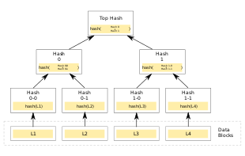

# Atala Prism Pioneer Program

## How is a DID represented?
[#appp-week01]()
Globally unique URI.

## What can a DID identify?
[#appp-week01]()
Person, organization, thing, data model, abstract entity, ... all via an URI.

## What is a DID-Controller?
[#appp-week01]()
The controller has control over the DID.<br>
I.e. he owns the private key of the master key of the DID.

## How is a DID represented on the Cardano blockchain?
[#appp-week01]()
Each DID associated with list of public keys, and a so called master-key.<br>
The controller must own the private key of the master key.

## How does a DID look like?
[#appp-week01]()
Like any URI:
<code><font style="color:deepskyblue">did</font>:<font style="color:darkmagenta">did-method</font>:<font style="color:darkgreen">did-method-specific-identifier</font></code>

E.g. `did:example:123456789abcdefghi`

## What is a Verified Credential?
[#appp-week01]()
A statement made by somebody for somebody else.<br><br>Issued by an <b>Issuer</b> (identified by a DID)<br>Issued to a <b>Holder</b> (the subject; identified by a DID)<br>Can be passed to and verified by a <b>Verifier</b>.

## Give an example of a Verified Credential
[#appp-week01]()
The issuer can be a university, the holder a stundent and statement that the student has earned a specific degree.

## What can a Verifier do with the Verified Credential?
[#appp-week01]()
He can check that the credential was indeed issued by the issuer (to the holder).

## Can a DID have multiple roles in a Verified Credential?
[#appp-week01]()
Yes

## Does all DID of a Verified Credential need to be published on the blockchain?
[#appp-week01]()
No

## Which DIDs must not be published on the blockchain in a Verified Credential?
[#appp-week01]()
The holder must not be published.<br><br>The issuer DID must be published.

## Can Verified Credentials be revoked?
[#appp-week01]()
Yes

## Can keys be added and removed from a DID?
[#appp-week01]()
Yes

## Name some areas where DIDs can be useful
[#appp-week01]()
Finance: For KYC
Governance: Voting
Healthcare: Covid-test-check
Supply-Chain: Circular-Supply-Chain, hard to check if doner's money reached the recipient (hard to track today)
Dev Impact: Similar to Governace
Edu-Career-Reputation: Add certificates and grades, also reputation

## What does SSI stand for?
[#appp-week01]()
Self-sovereign identity


## Describe SSI (Self-sovereign identity) by using an example
[#appp-w1-firechat]()
If you talk on the internet, you need to talk to somebody through "somebody else". Like through facebook, Google, Zoom, ... . There is a security issue.
SSI puts back the control to the party.

## Can SSI help me to, e.g., protect non-needed data from my driving licensed when I use my license is to show how old I am (e.g. at a bar)?
Yes.

## What is DIDComm?
[#appp-w1-firechat]()
Channel where two entities, identified by DIDs, can privately communicate.

## What can you do with a DID?
[#appp-week02]()
- Read (=DID Resolution), you retrieve DID Document
- Create
- Update
- Deactivate (not supported by Atala Prism, since semantics not clear)

## Why is Atala Prism not supporting Deactivation of DIDs? What does it support?
[#appp-week02]()
Because the semantics of "a deactivation" is not clear.

It supports to render a DID "useless", which could be seen as a deactivation.

## How does a Atala Prism DID look like?
[#appp-week02]()
`did:prism:71c00...XzA`

## Where are DIDs stored?
[#appp-week02]()
In a DID registry.

## What is the DID registry for Atala Prism?
[#appp-week02]()
The Cardano blockchain

## How long would you need to wait on the Cardano blockchain to make sure your changes to a DID will not be changed again?
[#appp-week02]()
Roughly 10min. .

## Why can something added to a block on the Cardano blockchain still change before roughly 10min. passed?
[#appp-week02]()
Because of rollbacks.

## Which two flavors of DIDs exist in Atala Prism?
[#appp-week02]()
Published and un-published.

## Which two forms of Prism DIDs exist? Why?
[#appp-week02]()
Long Form:
- E.g. `did:prism:71c...410:Cj8...XzA`
- Contains the document belonging to the DID
- Used for unpublished DIDs
Canonical
- E.g. `did:prism:71c...410`
- Does not contain the document belonging to the DID
- Used for DIDs which are published


## If the DID is not published, where does a Verifier can read/retrieve the document for this DID?
[#appp-week02]()
It's encoded in the DID, precisely the Long Form of a Prism DID.

## What are the contents of a Prism DID document?
[#appp-week02]()
- Id
- Public Keys
  - Id
  - Usage: master, issuing, revocation
  - ecKeyData

## What must be contained in a DID document?
[#appp-week02]()
Only an `Id`.

## What can be stored in a DID document?
[#appp-week02]()
Almost anything.

## What 'usage' is specified in the Prism DID document for the DID controller?
[#appp-week02]()
master

## What can the 'usage' 'issuing' of a DID document do?
[#appp-week02]()
Issuing credentials.

## How is ensured that a DID is not changed concurrently?
[#appp-week02]()
The next operation must provide the id of the previous operation.

So if two operations want to change the same DID, one of them will fail because it has the wrong "previous" hash.

## What is DIDcomm trying to achieve?
[#appp-week02]()
A secure, end-to-end, bidirectional communication between two entities which just know each others DID, nothing more.

## What additional information for a DID can be get from the blockchain?
[#appp-week03]()
`addedOn` and `revokedOn`

## What is a 'claim' in context of a Verified Credential?
[#appp-week03]()
Assertion/statement made about a subject.

## Can a Verified Credential have multiple 'claim's?
[#appp-week03]()
Yes

## How is a 'claim' expressed/defined?
[#appp-week03]()
Relation of subject-property-value. I.e. the subject has a property of value.

## How would the claim for a graduated student be defined?
[#appp-week03]()
```
                     alumniOf
Mike Glotzkowski --------------> Monster University
```

## What type has the property-value of a claim, as defined in Atala Prism?
[#appp-week03]()
The type is JSON.

## What type must the top-level object of a claim in Atala Prism have?
[#appp-week03]()
It must be a JSON object, i.e. key-value pairs.

## What is a guardian for a DID?
[#appp-week03]()
Someone who can manager your DID in case you cant. E.g. when you are still a child, when you dont have access to electricity/internet, ... .

## When is a guardian required?
[#appp-week03]()
When you - out of certain reasons - can not access your DID.

## What is the trust triangle?
[#appp-week03]()
```
    Holder
   /       \
Issuer <-- Verifier
```

Issuer issues a credential to aholder
Holder shares a privacy-respeting credential proof with a Verifier
Verifier must Trust the issuer.

## What is missing form the trust triangle?
[#appp-week03]()
The party which provides the trust which the verifier needs to have for issuers.

## Where is the trust in issuers provided/stored?
[#appp-week03]()
In the 'Trust Registry'.

## Who manages the Trust Registry?
[#appp-week03]()
The authority responsible in this domain.
E.g. a Governance Authority.
E.g. for driving licences it is a/the department for vehicles.

## Who is listed in the Trust Registry?
[#appp-week03]()
Issuer and Verifier

## Who uses the Trust Registry?
[#appp-week03]()
The Verifier and the Holder.

## Why is the Verifier listed in the Trust Registry?
[#appp-week03]()
E.g. dont want to share my driving license with a someone who should not be allowed to see it.

## What does a Trust Framework describe?
[#appp-week03]()
Before a Credential Holder and a Verifier (Relying Party) can interact, overarching layers like the legacy and SSI infrastructure of the Trust/Governance Framework musst be put in place.

## Does the issuer of a credential need to publish his DID?
[#appp-week04]()
Yes

## What types of keys are part of a DID?
[#appp-week04]()
Master, Issuing and revoke key.

## What can be issued and revoked with the issuing key and revoke key of a DID?
[#appp-week04]()
Credentials

## How can multiple credentials be published to the blockchain?
[#appp-week04]()
By batching them.

## Are batched credentials saved on the blockchain?
[#appp-week04]()
No

## What of batched credentials is saved on the blockchain?
[#appp-week04]()
The merkle root.

## What is revoked if you dont provide an credential hash? (i.e. empty array)
[#appp-week04]()
All credentials.

## How can it be checked if a credential was revoked?
[#appp-week04]()
With `getCredentialRevocationTime` from the node API.

## When you revoked a whole batch of credentials, how do you check if a credential was revoked?
[#appp-week04]()
Only by verifying a credential.
Note: `getCredentialRevocationTime` cant be used.

## How is a merke root created?
[#appp-week04]()
- Hash all credentials
- Pair credentials
- Compute next level of tree by
  - Concatenate paired credentials
  - Build hash over concatenated
- Repeat until only one hash remains = merkle root



## In a merkle root computation: What is done if there is no second hash which you can concatenate with?
[#appp-week04]()
Double the current hash.

## How can it be proofed that a credential was part of a batch?
[#appp-week04]()
- Provide a merkle proof (or merkle path)
- I.e. the missing pairs for the credential up to the root
- Compare the computed root with the merkle root on the blockchain

## What is the PanCanadian Trust Framework (PCTF) and what does it define?
[#appp-week04]()
- PCTF is a government-based framework around a single, central authority.
- All the trust belongs to this entity.
- It defines; Set of rules, requirements, network etc.

## What frameworks does Trust over IP (ToIP) provide?
[#appp-week04]()
Non-government governance frameworks.
E.g.
Corda, Financial Action Task Force (FATF), Liberty Identity Governance Framework, Mastercard, Visa, PanCanadian Trust Framework (PCTF), Sovrin, European Blockchain Services Infrastructure (EBSI)

## What is the "home page" of a governance framework (GF)?
[#appp-week04]()
The primary document for the GF.

## Can there be multiple versions of a governance framework (GF)?
[#appp-week04]()
Yes

## How are different versions of a governance framework (GF) defined/destinguished?
[#appp-week04]()
They are defined as unique _DID URLs_ per version.

## How is a governance framework (GF) identified?
[#appp-week04]()
As a DID.

## How are human-auditable requirements expressed in the Trust over IP (ToIP) framework?
[#appp-week04]()
Via policies.

## How are machine-testable requirements expressed in the Trust over IP (ToIP) framework?
[#appp-week04]()
Via rules.

## What does a policy in the context of Trust over IP (ToIP) contain?
[#appp-week04]()
It specifies set of processes and practices which an actor must follow in order to be compliant with the requirement.

## How are other documents in a trust framework references?
[#appp-week04]()
Via a (per version) unique DID and DID URL.

## Which are the 9 controlled documents of a governance framework (GF)?
[#appp-week04]()
Glossary
Risk Assessment
Trust Assurance and Certification
Governance Requirements
Business Requirements
Technical Requirements
Information Trust Requirements
Inclusion, Equitability, and Accessibility Requirements
Legal Aggreements

## What is a Trust Registry?
[#appp-week05]()
Mainly: Service for querying info required for trust decisions:
- Is the issuer of this Credential Authoritative?
- Is the verifier autorized to see my info/data?

## Why is a Trust Registry required?
[#appp-week05]()
For the verifier to know that the issuer is Authoritative.
For the holder to verify, that the verifier is allowed to see my data.

## What is wrong with the Trust Triangle?
[#appp-week05]()
It is missing the entity, the Governance Authority, which manages the trust into issuers and verifieres. I.e. it manages the Trust Registry which the Verifier can use to verify an issuer.

## What is the Trust Diamond?
[#appp-week05]()
It is the Trust Triangle with a Governance Authority (GA): The GA introduces trust for issuers and verifiers.

## What is the Governance Authority in the Trust Diamond doing?
[#appp-week05]()
- Manages Issuers
- Manages Verifiers
- Publishes these in the "Governanace Framework"
- Provides "a service" which allows to request if the issuer/verifier is trusted

## What is the part of the Governance?
[#appp-week05]()
Manage the complexity when large numbers of parties with different needs and incentives are involved.

## What answers does the Governance Authority need to answer?
[#appp-week05]()
- Is this Issuer authoritative?
- Is this Verifier authorized?
- Is this Trust Registry recognized?

## What is part of the internals of a Trust Registry?
[#appp-week05]()
Manage key information, CRUD and lifecycle.
- Governance Frameworks
- Membership
- Credential Schema & Definitions
- Presentation Requests
- etc.

## What is part of the extenrals of a Trust Registry?
[#appp-week05]()
All visible to public
- Governance Frameworks
- Issuers
- Verifiers
- Trust Registries
- Credential Schema & Definitions
- Presentation Requests

## What does an ecosystem need to specify for a Verifiable Credential?
[#appp-week05]()
All required Credential **Types**.

## What does an ecosystem need to specify about the holder?
[#appp-week05]()
Is the wallet of the holder approved to be used in the ecosystem.

## What does an ecosystem need to specify about a Proof requested from a holder by a Verifier?
[#appp-week05]()
Decide if the requested usage of the credential is normal or abnormal?
